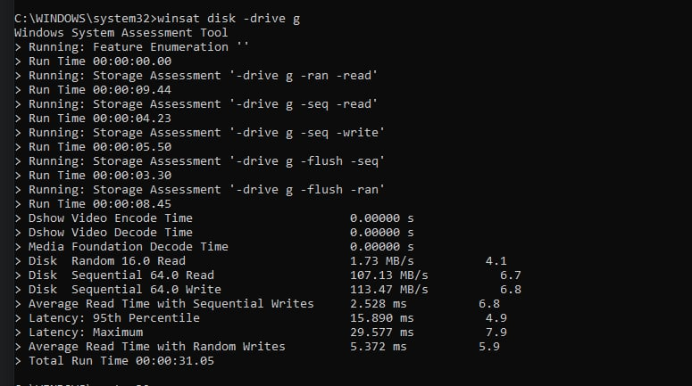

## First attempt

### Dumb reader
The inputs are given in format <city>;<temp>. The cities can have spaces in the name. So, we can't use normal input method here. My first thought was the simplest one, using `getline`. Result? reading 10^8 rows in 1m20s. Yes, just reading. 

### Fast IO
Solution? use `std::ios::sync_with_stdio(false); cin.tie(0)`. Why?
By default, the C++ standard streams (std::cin, std::cout, etc.) are synchronized with their C counterparts (stdin, stdout, etc.). This ensures that the input/output operations between C and C++ are consistent, so you can mix calls like std::cin with printf, or std::cout with scanf, without breaking things.

When you disable this synchronization, the C++ streams (std::cin, std::cout) become independent of the C streams (stdin, stdout). This allows C++ streams to perform input/output operations more efficiently because they no longer need to coordinate with the C standard streams. Thus making it faster.

Result? Reading all input take about 2m now. So, about 12s per 10^8 rows. Huge improvement. 


But we just dont need to read the inputs, we need to seperate the city names, temperature and then convert that temperature to float if it is not already. Sounds simple. However, with this added the time to process 10^8 rows increases drastically to 50s. I really don't know why. Need to check up on this further. 

### Buffered Reader

Solution? read inputs as buffered reader. This is the fastest way to read any kind of data. As disk io is slow, we read a chunk of data and process it. Using buffered reader in C is a bit tough but doable. With this we decrease the time to process 10^8 rows to 25 seconds. ie in total takes about 4m30s

So, i guess we have found our winner for reading the inputs. Then we need to actually do stuffs with them, ie find min, max, mean of the data.

well how can we store them? we definetely can't just store them all in an array. Its too much. We can optimize it later. But for now what we can do is we can create a map with the city name as key and the value as a struct with {sum,count,min,max} as value. Thus each time we read a new entry we update the map. Sounds simple. it is. So, after this, the time to process 10^8 rows is increased to 50ish seconds and to complete the whole process it takes 8m24s. 

We can optimize this straight way. The map is a data structure that implements some form of self balancing tree. Accessing data takes logarithmic time. So, we are doing that for 10^9 times! Huge waste of time. What could we do? We can change it to something that enables accessing with random keys but is in constant time. It's hash map. C++ has unordered_map for this. We just change the map to unordered_map. Boom. We decreased the time to process 10^8 rows to 35s and to process the whole data we need 5m46s. 

So, this is our starting point. Or the time to beat. Let's optimize.


## Second Attempt
How can we improve upon this? At first let's revisit the whole workflow. 
1. We read chunks from the disk
1. Read lines from the chunk
1. Parse city name and temperature from the line
1. Update the city information

Seems simple, until you notice some issues. Reading from disk is an io operation and its very slow (unless you are using SSD). Morever, its a blocking operation. It means our program will not do anything at that time although the work is being done by the disk and we are doing nothing. We could process some previously read data at this time. So, it will work something like this, we will read some chunk. Then will process part of the chunk and while doing so we will start reading another one. We can do this using threads. One thread will read the chunks and go through line by line of a chunk. Then another thread will process it. Seems familiar? It good old producer consumer design. We can use multiple consumer. We can also use multiple producer, but that's for future. 

Let's stop here a moment. C++ doesn't have thread functionalities built in. We need posix compatible pthread implementation for it. Morever, working with threads in C is a pain. If we are working with thread then let's switch to Golang. 

### Let's start again
We will rewrite the whole thing again in Go. To make sure everything is working nicely, we again read the whole file using the already implemented buffered reader in go (Life is much simpler here). It takes about 2m3s to just read the whole file. If we remember, doing so in C++ took about 2m8s! That's almost the same. So, we are good to go. And for completing the whole challenge takes about 2m48s! Even faster than the C++ one.

### Adding producer and consumer
For anyone who is new to this, there is a simple producer and consumer example here, where a producer will produce something and consumers will consume them. After the production is complete, producer will end and consumers will finish after consuming and processing everything. We are using go routine for the parallelist. For communication between the threads we use go channels and to wait for the threads to finish we use wait groups. 

Guess how much it takes now? 11m16s 😑 . WTF! How on earth it got worse!?

### Debugging, profiling and buffering

Remember how using buffered reader significantly improved our file reading time? Keep that in mind. 

Now then, back to the problem. Why is it taking so long? We can try to improve our implementation or algorithm, but there's a high chance we might be improving the wrong part of the code. Before starting we need to find the bottleneck or which part is causing problem. Luckily for us Golang has a profiler! 

Just add this line of code at the start of main
```go
f, _ := os.Create("cpu.prof")
pprof.StartCPUProfile(f)
defer pprof.StopCPUProfile()
```
Then build the binary and run the profiler
```bash
# build
go build -o main main.go
go tool pprof main cpu.prof
```
This will open the profiler info in interatice mode. To show the top resource consumer run `top`. The output for us is
```bash
 flat   flat%   sum%    cum     cum%
66.53s  25.48%  25.48%  66.53s  25.48%  runtime.procyield
53.62s  20.54%  46.02%  53.62s  20.54%  runtime.stdcall2
35.07s  13.43%  59.46%  157.79s 60.44%  runtime.lock2
22.25s  8.52%   67.98%  32.30s  12.37%  runtime.unlock2
14.39s  5.51%   73.49%  14.43s  5.53%   runtime.stdcall1
8.93s   3.42%   76.91%  99.85s  38.25%  runtime.chanrecv
6.46s   2.47%   79.38%  111.29s 42.63%  runtime.chansend
3.72s   1.42%   80.81%  3.72s   1.42%   runtime.memmove
3.32s   1.27%   82.08%  3.32s   1.27%   runtime.(*waitq).dequeue (inline)
3.24s   1.24%   83.32%  3.27s   1.25%   runtime.stdcall0
```
By analyzing this output we can see that there are many resource consuming functions. Although we might not understand all of them. However procyield, lock, unlock, chanrecv these culprits are due to go concurrency. This indicates contention and synchronization issues in the program. ie the threads are fighting each other for the channels read and write too much. As channels lock during read and write, so there is a significant wait time for threads.

Solution? Use buffer here too! Instead of readily write to the channels, we buffer them in an array or something. When it hits a certain size, then we write it to the channels. 

```bash
  flat  flat%   sum%        cum   cum%
65.44s 14.92% 14.92%     65.45s 14.92%  runtime.stdcall2
24.72s  5.63% 20.55%     85.20s 19.42%  runtime.mallocgc
20.06s  4.57% 25.12%     20.90s  4.76%  runtime.cgocall
19.20s  4.38% 29.50%     19.21s  4.38%  runtime.stdcall1
18.53s  4.22% 33.72%     18.53s  4.22%  runtime.stdcall3
18.21s  4.15% 37.87%     18.24s  4.16%  strconv.readFloat
15.85s  3.61% 41.49%     31.36s  7.15%  runtime.mapaccess2_faststr
14.69s  3.35% 44.83%     14.69s  3.35%  runtime.memclrNoHeapPointers
11.01s  2.51% 47.34%     73.45s 16.74%  strings.genSplit
10.50s  2.39% 49.74%     14.87s  3.39%  runtime.findObject
```

Result? 2m4s! If we see the profiler result we will see those concurrency based bottlenecks are gone. Also, if you remember, the time to only read data from the file was 2m3s. So, we are now limited by the speed of disk IO! We have optimized our CPU bound tasks efficiently. 

It's a great checkpoint. If you have achieved this result, then you deserve a pat in the back just like I do! 


### Hardware, HDD, SDD and read speed
As we have seen earlier we are bottlenecked by our file reading which was 2m3s. We can think of someway to increase the speed? May be read the file in chunks? or read the file in parallel ie divide the file in multiple parts and read them in parallel. Seems about right. However reading a file in parallel has some problems. How can we know that we are dividing the files correctly? May be we have partitioned the file causing an input to be split into two segment? It's not that hard to solve this though. I wrote some code for this too to check the time. Well? With concurrency of 2 or 4 or 10 doesn't matter the time doesn't decrease. It increases due to concurrency overhead. What are we not considering? 

So far we have only focused on software and didn't think much about hardware. Let's see why we should also think about hardware. At first let's find the HDD disk IO speed. Running `winsat disk -drive g` command gives us the sequential read speed at 107MB/s. Our file size is 13795961879B ie 13,156MB. So, time required to read the file of size 13,156MB at a speed of 107MB/s will take 13,156/107 = 122.96s = 2m3s! Holy moly! This is insanely accurate. I know you won't believe me, so i am attaching a screenshot. So, no matter what we do we can't go lower than this.



Unless, we switch to SSD! I luckily have a SSD storage too! The read speed of the SSD? 1586MB/s. Yup, 1.5GB/s. We can read the whole file withing 10s or may be even faster.  So, we don't need to do any shenanigans with reading files. So, our bottleneck from file io is gone. We can focus on the processing again. 

Without chaning any codes whatsover we run the code for our fourth try. It comes out at 1m50s. We run the profiler again and get the following output
```bash
  flat  flat%   sum%        cum   cum%
   39s 13.05% 13.05%     39.01s 13.05%  runtime.stdcall2    
16.76s  5.61% 18.66%     17.60s  5.89%  runtime.cgocall     
16.08s  5.38% 24.04%     30.96s 10.36%  runtime.mapaccess2_faststr
15.14s  5.07% 29.10%     15.16s  5.07%  runtime.stdcall3
14.86s  4.97% 34.08%     14.87s  4.98%  runtime.stdcall1
11.61s  3.88% 37.96%     11.67s  3.90%  strconv.readFloat
10.66s  3.57% 41.53%     10.66s  3.57%  runtime.memclrNoHeapPointers
10.61s  3.55% 45.08%     41.40s 13.85%  runtime.mallocgc
 9.48s  3.17% 48.25%      9.48s  3.17%  indexbytebody
 9.06s  3.03% 51.28%      9.06s  3.03%  aeshashbody
```

If you can't understand what's this, then don't worry. I didn't too. However, we can see some familiar terms like mallocgc, memclr, heap pointers. These are related to heap memory. What's happening here is that we are constantly creating new arrays in heap. As go has no free function to clear memories, so the garbage collector is doing works in the background also causing some overheads. Solution? Use a memory pool. We create an global array of free resources. We produce to any of the free resource and consume from it. So, now instead of sending the array (the pointer actually) we send the index. Seems similar. It is, we are just optimizing the usage. Result? 59s. Big win. Current profile output is

```bash
      flat  flat%   sum%        cum   cum%
    14.85s 10.61% 10.61%     15.20s 10.86%  runtime.cgocall
    14.46s 10.33% 20.94%     24.71s 17.65%  runtime.mapaccess2_faststr
    11.88s  8.49% 29.42%     11.94s  8.53%  strconv.readFloat
     9.33s  6.66% 36.09%     18.03s 12.88%  runtime.mallocgc
     8.32s  5.94% 42.03%      8.32s  5.94%  indexbytebody
     7.06s  5.04% 47.07%     31.83s 22.74%  main.mergeCities
     6.37s  4.55% 51.63%      6.37s  4.55%  strconv.atof64exact
     4.93s  3.52% 55.15%     54.96s 39.26%  main.producer
     3.84s  2.74% 57.89%      3.84s  2.74%  runtime.nextFreeFast (inline)
     3.81s  2.72% 60.61%      3.81s  2.72%  memeqbody
```

### How far can we improve?
Let's go look for other's implementation and see about their timings. Ben Hoyt also did this challenge. We will take his best time and his worst time. From his repo 

> These are my progressively-faster solutions to the One Billion Row Challenge in Go: from a simple unoptimised version (r1.go) that takes 1 minute 45 seconds, to an optimised and parallelised version (r9.go) that takes 4 seconds.

The code run in the current configuration takes 2m49s and the final one takes 5s. (Holy shiet!) I need to keep up my game. 

Honestly speaking, I am done :(

### Break it down further
No I am not done! Let's go again. We will bit by bit break every part of code and try to find out what's the fucking bottleneck. 

We can read the file in less than 10s with that 1.5GB/s speed. Then let's see how much it takes to only split that in lines. After a bit change it turns out it alone takes 1m! What? Yes it makes sense now.

We are not utilizing our CPU properly. Although we are reading the file fast and processing everything fast too. We forgot one thing. We are spliting the file in lines in one single thread. This makes it the bottleneck. Solution? Read the file in chunks, send them to processors and let them do the processing line by line. Theoretically this is ok. However we have one small issue. How can we split the file in perfect chunks? It's a bit tricky, but doable. We read a chunk. Find the last position of newline. Send chunk up untill that position to the workers and keep the remaining portions in buffer. We will prepend it with the next chunk. This leads to our time to 40s! Another 10s improvement.

Let's pause here. Break down the workload. 
We have 3 stages. At first read the file in chunks. Then we send the chunks to next stages where multiple workers process them. Finally, all the results are accumulated and the final result is found. Seems familiar? No? Yes? It's freaking MapReduce! We have gradually wrote a MapReduce without even knowing! 

### The MapReduce
There are multiple stages in an actual MapReduce. We will keep it simple. We will have splitter, mapper and reducer. At first we will split the file into multiple jobs. The mapper will map inputs in key value pair. Finally the reducer will combine results of multiple mapper jobs. We will rewrite some of our codes to align with the mapreduce paradigm. And guess what? It's 20s! 


### Final 
After profiling we find that the `strconv.ParseFloat()` takes about 7s! That shouldn't happen. It's a simple parsing and we will implement it ourself. Morever as the precision is only 1 digit, we will just use int throughout the operation and will output the final result divided by 10. This simple improvement decreases our runtime to 0m15s! 

We can improve some more. Notice how we are parsing a line? We at first extract a line using `reader.ReadString('\n')`. Then we seperate the city and temperature using `strings.Cut`. Then parse the temperature. So, we are looping over the same data 3 times. We can do all of that ourselves in one loop. The code will get messy but fast. This simple change improved our code to 0m11s! 

Instead of using string as the map key, we will use the hash. We will use a rolling hash for it. Luckily we can do it in the loop for reading the map! This decreases another second! 

And we are done. We can improve more though. The map takes a lot of time. We can use some sort of implementation ourselves. But it is enough for me! Ben Hoyt did it in 5s. I am happy I could do it at double his time. I will need to live twice to be like him. Till then bye!


